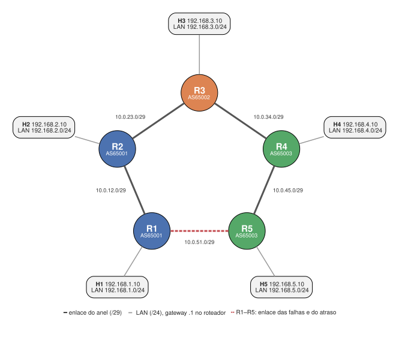
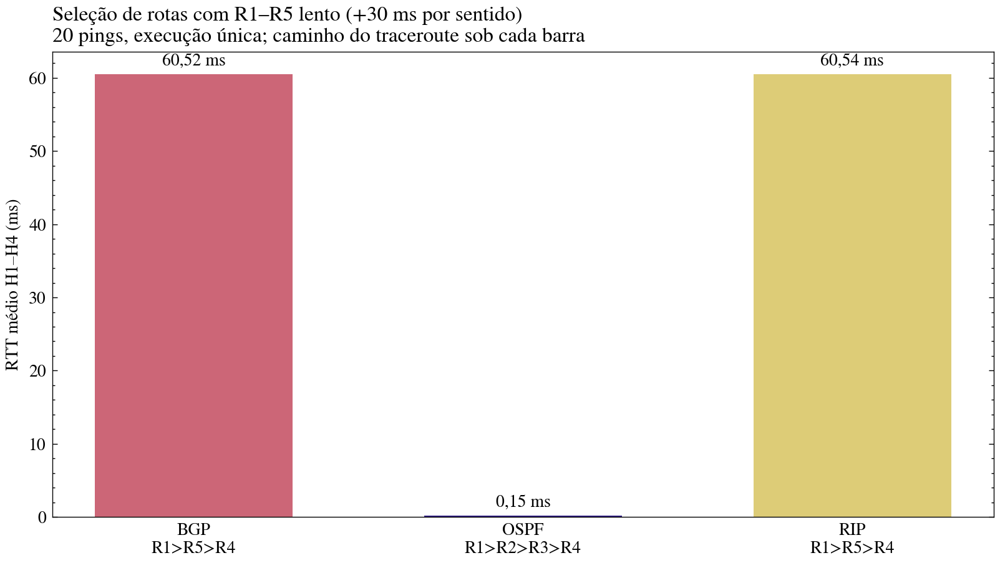
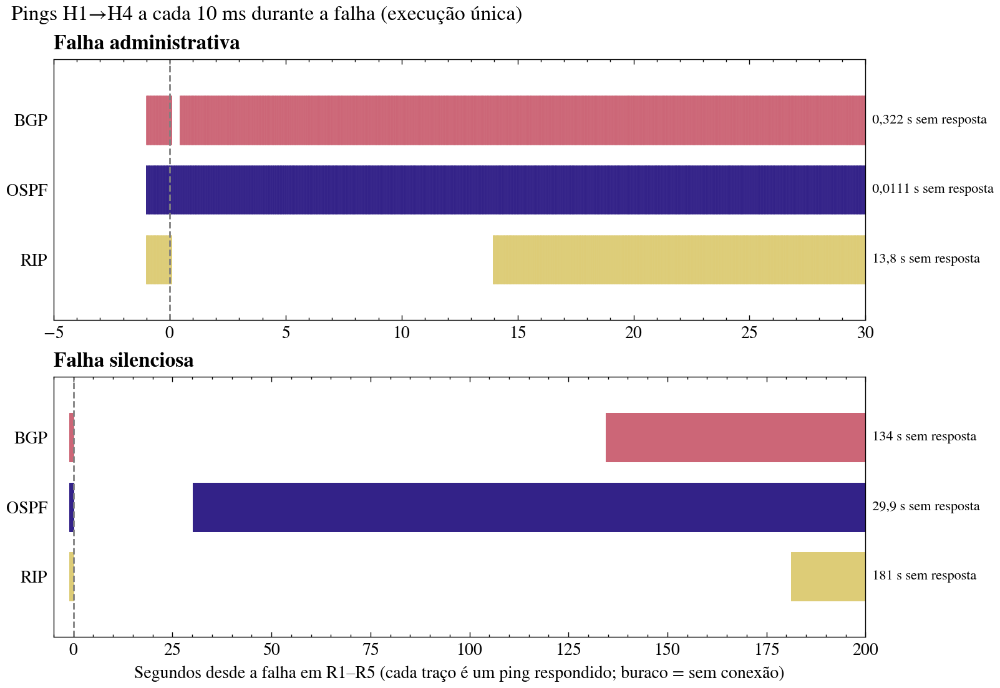
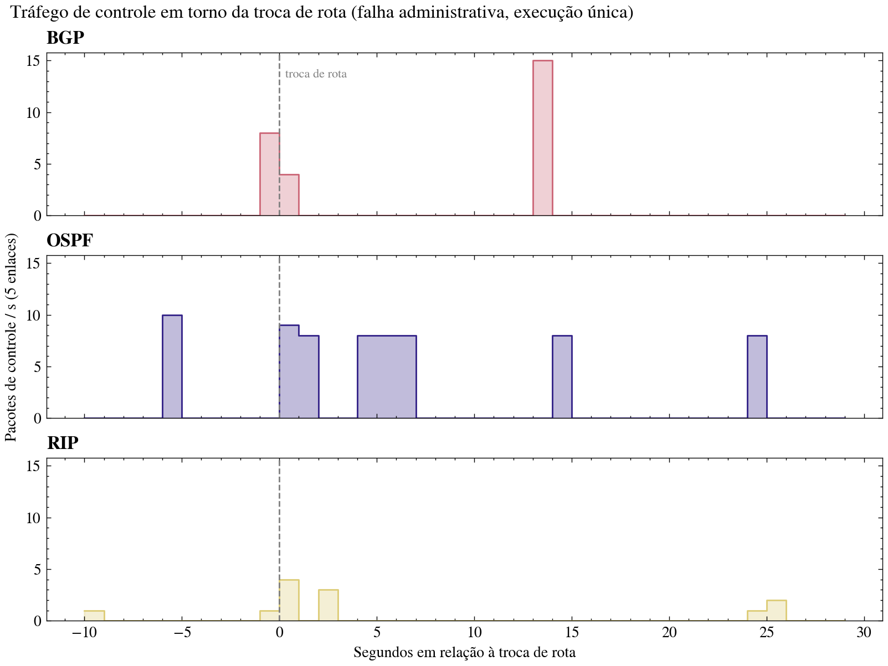
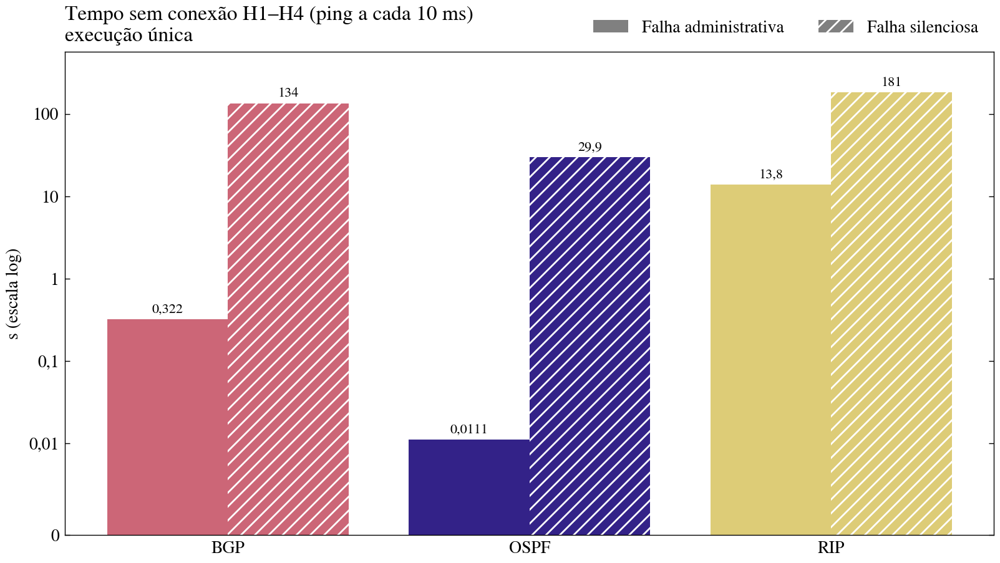
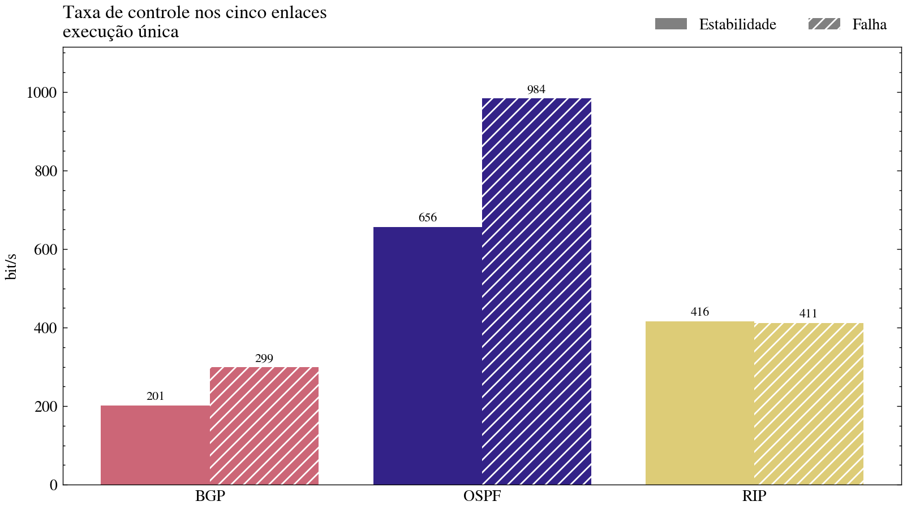
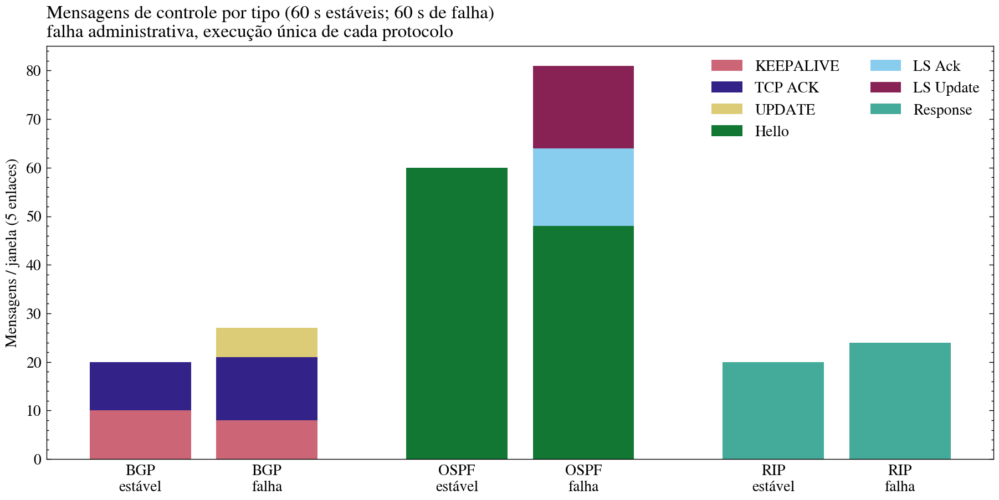
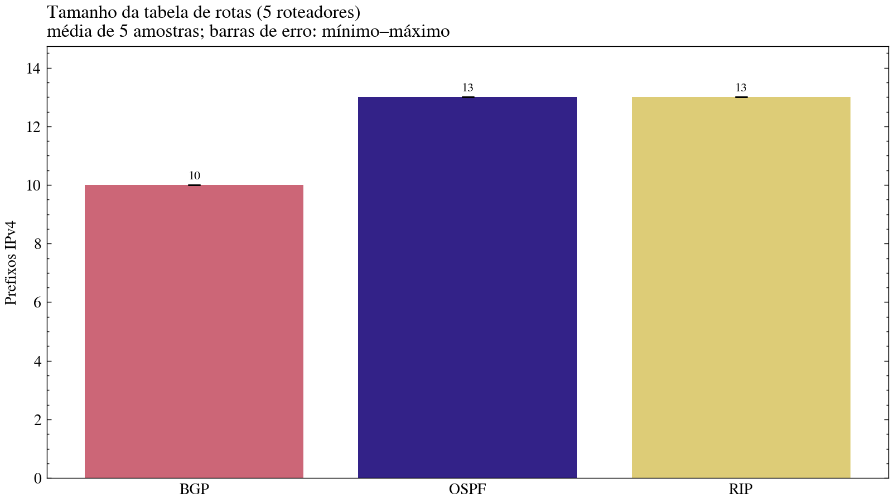

# Comparação de roteamento: BGP, OSPFv2 e RIPv2

Primeiro trabalho de Redes 2. O laboratório tem cinco roteadores FRRouting e cinco hosts, ligados em anel para haver caminhos redundantes. Os três protocolos rodam sobre a mesma topologia, um de cada vez. No BGP, os roteadores formam três sistemas autônomos; no OSPF e no RIP, o anel é um único domínio.

As seções seguem a ordem dos itens de avaliação do enunciado:

| Item da avaliação | Seção |
|---|---|
| 2. Instalar e configurar a plataforma de roteamento | [1. Plataforma de roteamento](#1-plataforma-de-roteamento) |
| 3. Definir e configurar a topologia física | [2. Topologia física](#2-topologia-física) |
| 4. Definir e configurar a topologia lógica | [3. Topologia lógica](#3-topologia-lógica) |
| 5. Configurar os três protocolos de roteamento | [4. Configuração dos protocolos](#4-configuração-dos-protocolos) |
| 6. Coletar diferentes métricas de roteamento | [5. Coleta de métricas](#5-coleta-de-métricas) |
| 7. Comparar os três algoritmos com gráficos para cada métrica | [6. Comparação dos protocolos](#6-comparação-dos-protocolos) |
| 8. Entregar o vídeo | [7. Vídeo](#7-vídeo) |

## 1. Plataforma de roteamento

### 1.1 Por que FRRouting

A plataforma é o [FRRouting](https://frrouting.org/) (FRR) 10.7.0, continuação do Quagga citado no enunciado. Ele foi escolhido pelos seguintes motivos:

- **Os três protocolos numa só ferramenta.** BGP, OSPF e RIP vêm na mesma suíte, com a mesma CLI (`vtysh`). Os três cenários usam a mesma imagem e os mesmos comandos de diagnóstico; só muda o protocolo.
- **Um protocolo por vez.** Cada protocolo é um daemon separado, ligado no arquivo `configs/PROTOCOLO/daemons`. Cada cenário habilita só um deles, como o enunciado exige.
- **Configuração no estilo Cisco IOS** (`router ospf`, `network ... area 0`, `neighbor ... remote-as`), a mesma dos livros e dos equipamentos de mercado.
- **Roda em contêiner.** Há imagem oficial, então os dez nós cabem numa única máquina, e cada cenário é recriado do zero com um comando.

### 1.2 Ambiente de execução

Tudo o que está em `results/` foi produzido numa única máquina Linux, acessada por SSH.

| Item | Valor |
|---|---|
| Máquina | HP ProDesk 600 G6 Desktop Mini PC |
| CPU | Intel Core i5-10500T, 6 núcleos / 12 threads, 2,3–3,8 GHz |
| Memória | 14 GiB de RAM |
| Sistema | Ubuntu 26.04 LTS, kernel 7.0.0-34-generic x86_64 |
| Contêineres | Docker Engine 29.6.1, Docker Compose 5.3.0 |
| Imagens | `quay.io/frrouting/frr:10.7.0` (roteadores) e `alpine:3.22.5` (hosts) |
| Ferramentas | TShark 4.6.4, Python 3.14.4 |

### 1.3 Instalação e uso

Requisitos: Linux com Docker e Compose, Bash, Python 3 e TShark. O FRR roda em contêiner: o `Dockerfile` parte da imagem oficial e o `compose.yaml` cria roteadores, hosts e redes. Os gráficos são gerados pelo `scripts/plot.sh` num contêiner próprio.

```bash
sudo apt install tshark
sudo modprobe sch_netem                 # necessário para o enlace lento da seleção de rotas

./scripts/lab.sh up bgp                 # sobe um cenário (bgp, ospf ou rip); recria tudo
./scripts/lab.sh shell r1               # vtysh no R1
./scripts/test.sh bgp                   # vizinhos, LANs, ping, FIB, falha R1–R5 e restauração
./scripts/lab.sh down

./scripts/collect.sh                    # coleta completa, cerca de 34 min
```

O `collect.sh` apaga `results/csv/` e `results/graphs/` e refaz tudo (seção 5.1). O log da rodada fica em `results/raw/collect.log`.

## 2. Topologia física



Cinco roteadores ligados em anel (R1–R2–R3–R4–R5–R1), cada um com uma LAN e um host. Cada enlace e cada LAN é uma rede bridge interna do Docker (`internal: true`), sem saída para fora do servidor. Nos roteadores, os enlaces são as interfaces `ringXY` (por exemplo `ring12`) e a LAN é a interface `lan`, com os mesmos nomes nos três cenários.

O anel oferece dois caminhos entre quaisquer duas LANs. De H1 a H4, o caminho normal é R1–R5–R4; com R1–R5 fora do ar, o tráfego segue por R1–R2–R3–R4. É esse enlace que os experimentos derrubam ou tornam lento (seção 5).

## 3. Topologia lógica

### 3.1 Endereçamento

| Enlace | Endereços dos roteadores |
|---|---|
| R1–R2 | 10.0.12.1 (R1), 10.0.12.2 (R2) /29 |
| R2–R3 | 10.0.23.1 (R2), 10.0.23.2 (R3) /29 |
| R3–R4 | 10.0.34.1 (R3), 10.0.34.2 (R4) /29 |
| R4–R5 | 10.0.45.1 (R4), 10.0.45.2 (R5) /29 |
| R5–R1 | 10.0.51.1 (R5), 10.0.51.2 (R1) /29 |

| LAN | Gateway (roteador) | Host |
|---|---|---|
| 192.168.1.0/24 | 192.168.1.1 | 192.168.1.10 |
| 192.168.2.0/24 | 192.168.2.1 | 192.168.2.10 |
| 192.168.3.0/24 | 192.168.3.1 | 192.168.3.10 |
| 192.168.4.0/24 | 192.168.4.1 | 192.168.4.10 |
| 192.168.5.0/24 | 192.168.5.1 | 192.168.5.10 |

Cada host usa como rota padrão o roteador da sua LAN, e os roteadores não têm rota padrão: tudo o que sabem das outras LANs vem do protocolo em execução.

### 3.2 Domínios de roteamento

| Protocolo | Organização |
|---|---|
| BGP | três sistemas autônomos: AS65001 (R1, R2), AS65002 (R3) e AS65003 (R4, R5). iBGP em R1–R2 e R4–R5; eBGP em R2–R3, R3–R4 e R5–R1 |
| OSPFv2 | os cinco roteadores numa única área, a área 0 (backbone) |
| RIPv2 | os cinco roteadores num único domínio |

No BGP, R3 é um AS de trânsito: com R1–R5 fora do ar, o tráfego entre AS65001 e AS65003 passa por ele.

## 4. Configuração dos protocolos

As configurações estão em `configs/{bgp,ospf,rip}/r{1..5}/frr.conf`, comentadas comando a comando, e são montadas somente para leitura nos contêineres. Os temporizadores padrão foram mantidos nos três protocolos.

| Protocolo | Configuração principal | Temporizadores |
|---|---|---|
| BGP | cada roteador origina só a sua LAN (`network`); `next-hop-self` no iBGP; no eBGP, a prefix-list `LANS` filtra entrada e saída, como exige o `ebgp-requires-policy` | keepalive 60 s, hold 180 s |
| OSPFv2 | enlaces `point-to-point` com `cost 10`; LANs passivas | hello 10 s, dead 40 s |
| RIPv2 | `version 2`, split horizon (padrão), LANs passivas | update 30 s, timeout 180 s, garbage 120 s |

Configuração BGP do R1, sem comentários (a prefix-list `LANS` permite só as cinco LANs /24). As de OSPF e RIP são mais curtas e estão nos `frr.conf`:

```text
router bgp 65001
 bgp router-id 1.1.1.1
 bgp ebgp-requires-policy
 neighbor 10.0.12.2 remote-as 65001
 neighbor 10.0.51.1 remote-as 65003
 address-family ipv4 unicast
  network 192.168.1.0/24
  neighbor 10.0.12.2 next-hop-self
  neighbor 10.0.51.1 prefix-list LANS in
  neighbor 10.0.51.1 prefix-list LANS out
```

No BGP, o `next-hop-self` é necessário porque não há IGP: sem ele, R2 receberia como próximo salto 10.0.51.1, para o qual não tem rota. No OSPF, o tipo `point-to-point` dispensa a eleição de DR/BDR, já que só há dois roteadores em cada /29, e o custo fixo evita depender da velocidade que o kernel informa para a veth.

**Validação.** O `test.sh` confere, em cada cenário, os vizinhos, a instalação das quatro LANs remotas em cada roteador, o ping entre hosts, os próximos saltos na FIB, a falha de R1–R5 e a restauração. Os três protocolos passaram, e o traceroute ICMP de H1 a H4 deu o mesmo resultado nos três (`results/raw/test-*/`):

```text
Normal/restaurado: 192.168.1.1 → 10.0.51.1 → 10.0.45.1 → 192.168.4.10
Com R1–R5 fora:    192.168.1.1 → 10.0.12.2 → 10.0.23.2 → 10.0.34.2 → 192.168.4.10
```

## 5. Coleta de métricas

### 5.1 Como a coleta foi feita

Cada execução recria o cenário, espera vizinhos, rotas e ping e aguarda mais 30 s de aquecimento, para que a formação das adjacências do OSPF não entre na medição. Depois, passa por estas fases:

1. **Fase estável (60 s):**
   - H1 envia 100 pings a H4 (RTT e perda);
   - o tráfego de controle é capturado em cada enlace, nos dois sentidos (5 PCAPs por execução);
   - CPU e memória vêm do `docker stats`.
2. **Falha no enlace R1–R5:** H1 envia um ping a H4 a cada 10 ms, e R1 e R5 registram as mudanças de rota do kernel (`ip -ts monitor`). Há dois tipos de falha:
   - **administrativa** (`ip link set down`, janela de 60 s): o kernel detecta a queda na hora;
   - **silenciosa** (`tc netem loss 100%`, janela de 240 s): o enlace continua up e só os temporizadores do protocolo percebem a falha, por isso a janela cobre o timeout de 180 s do RIP.
3. **Restauração:** o enlace volta e o caminho original é conferido.
4. **Seleção de rotas:** num cenário recriado, o enlace R1–R5 fica lento e o traceroute mostra o caminho que cada protocolo escolhe (seção 6.2).

Por fim, o `collect.sh` conta as mensagens por tipo nos PCAPs e gera os gráficos. Os CSVs ficam em `results/csv/`; PCAPs, traceroutes e logs ficam em `results/raw/`, fora do Git.

### 5.2 Resultados

Cada protocolo teve uma execução com falha administrativa, uma com falha silenciosa e o experimento de seleção de rotas. Em todas, as capturas não perderam pacotes, os pings estáveis tiveram 0% de perda e cada roteador instalou as quatro LANs remotas.

**Regime estável** (60 s, execução com falha administrativa):

| Métrica | RIP | OSPF | BGP |
|---|---:|---:|---:|
| Pacotes de controle (5 enlaces) | 20 | 60 | 20 |
| Taxa de controle (bit/s) | 416,0 | 656,0 | 201,3 |
| Prefixos na tabela de rotas, por roteador | 13 | 13 | 10 |
| LANs remotas instaladas, por roteador | 4 | 4 | 4 |
| RTT médio H1–H4 (ms) | 0,145 | 0,136 | 0,144 |
| RTT p95 H1–H4 (ms) | 0,179 | 0,169 | 0,164 |
| CPU média dos 10 contêineres (%) | 0,38 | 0,33 | 0,58 |
| Memória dos 10 contêineres (MiB) | 92,1 | 98,4 | 122,9 |

**Falha administrativa** (R1–R5 em `link down`, janela de 60 s):

| Métrica | RIP | OSPF | BGP |
|---|---:|---:|---:|
| Tempo sem conexão H1–H4 (s) | 13,81 | 0,011 | 0,322 |
| Tempo até a rota nova no kernel (s) | 13,82 | 0,012 | 0,371 |
| Pacotes de controle na janela | 24 | 81 | 27 |
| Taxa de controle na janela (bit/s) | 411,2 | 983,7 | 298,9 |
| Mensagens de atualização nos 10 s de convergência | 8 | 33 | 6 |
| Mensagens de atualização na janela | 24 | 33 | 6 |
| CPU média dos 10 contêineres (%) | 6,6 | 6,8 | 6,9 |

**Falha silenciosa** (R1–R5 com 100% de perda, janela de 240 s):

| Métrica | RIP | OSPF | BGP |
|---|---:|---:|---:|
| Tempo sem conexão H1–H4 (s) | 180,9 | 29,9 | 134,1 |
| Tempo até a rota nova no kernel (s) | 181,1 | 30,1 | 134,4 |
| Temporizador que detectou a falha | timeout 180 s | dead 40 s | hold 180 s |
| Pacotes de controle na janela | 67 | 209 | 64 |
| Taxa de controle na janela (bit/s) | 326,7 | 584,1 | 171,3 |
| Mensagens de atualização na janela | 67 | 16 | 6 |
| CPU média dos 10 contêineres (%) | 2,5 | 1,0 | 2,2 |

"Tempo sem conexão" é a lacuna nas respostas do ping a cada 10 ms; "tempo até a rota nova" é o maior valor entre R1 e R5. Os dois ficaram a menos de 0,4 s um do outro, ou seja, a conexão volta assim que a rota nova é instalada.

**Seleção de rotas** (R1–R5 com 30 ms por sentido; 20 pings por protocolo):

| Protocolo | Próximo salto em R1 | Caminho (traceroute) | RTT médio H1–H4 |
|---|---|---|---:|
| RIP | 10.0.51.1 (R5) | R1–R5–R4 | 60,54 ms |
| OSPF | 10.0.12.2 (R2) | R1–R2–R3–R4 | 0,15 ms |
| BGP | 10.0.51.1 (R5) | R1–R5–R4 | 60,52 ms |

## 6. Comparação dos protocolos

Os gráficos de controle, linha do tempo e mensagens usam a execução com falha administrativa. As subseções seguem os critérios de comparação do enunciado.

### 6.1 Princípio de funcionamento

| Protocolo | Princípio | O que troca com os vizinhos | Visão da rede |
|---|---|---|---|
| RIP | vetor de distância (Bellman-Ford) | a tabela inteira, com a distância em saltos, a cada 30 s (UDP 520) | só a distância e o próximo salto anunciados pelos vizinhos |
| OSPF | estado de enlace (Dijkstra/SPF) | Hellos para manter os vizinhos e LSAs, inundados só quando um enlace muda | o mapa completo da área (LSDB), igual em todos os roteadores; cada um calcula a própria árvore de caminhos mínimos |
| BGP | vetor de caminhos | UPDATE com prefixo e AS_PATH só quando algo muda e KEEPALIVE a cada 60 s, em sessões TCP 179 com vizinhos configurados | os caminhos anunciados, cada um com sua lista de AS; a política decide qual usar, e o AS_PATH evita laços |

### 6.2 Seleção de rotas e delay

No anel simétrico, os três protocolos levam H1→H4 por R1–R5–R4 (seção 4), e o RTT estável é praticamente o mesmo: 0,136 a 0,145 ms de média.

Mas cada protocolo chega a esse caminho por um critério diferente:

| Protocolo | Critério | R1–R5–R4 | R1–R2–R3–R4 |
|---|---|---|---|
| RIP | menor número de saltos | 2 saltos | 3 saltos |
| OSPF | menor soma de custos | 10 + 10 = 20 | 10 + 10 + 10 = 30 |
| BGP | política; aqui decide o AS_PATH mais curto | `65003` | `65002 65003` |

Para separar esses critérios, o experimento de seleção acrescenta 30 ms por sentido em R1–R5 (`tc netem delay`). Só no OSPF, o custo desse enlace sobe para 100, como faria um operador que mede o atraso. RIP e BGP não enxergam atraso e devem continuar pelo enlace lento. O OSPF passa a comparar 110 com 30 e desvia por R2–R3.



RIP e BGP continuaram no enlace lento, com cerca de 60 ms de RTT, e o OSPF desviou por R2–R3, mantendo 0,15 ms. O OSPF só desviou porque o custo do enlace foi aumentado; nenhum dos três protocolos mede atraso por conta própria.

### 6.3 Comportamento diante de mudanças na topologia

<table>
<tr>
<td width="50%"><br><sub>Pings H1→H4 a cada 10 ms durante a falha</sub></td>
<td width="50%"><br><sub>Tráfego de controle por segundo em torno da troca de rota</sub></td>
</tr>
<tr>
<td width="50%"><br><sub>Tempo sem conexão H1–H4: falha administrativa × silenciosa</sub></td>
<td width="50%"><br><sub>Tempo até a rota nova no kernel: falha administrativa × silenciosa</sub></td>
</tr>
</table>

**Falha administrativa.** Com R1–R5 derrubado nas duas pontas, o kernel avisa a queda na hora, e o que se mede é a reação de cada protocolo:

- **OSPF:** gerou um LSA novo imediatamente, recalculou o SPF e trocou a rota. O ping a cada 10 ms perdeu praticamente só um pacote.
- **BGP:** retirou as rotas da sessão perdida, recebeu de R2 o UPDATE com o caminho via AS65002 e o instalou. Os 6 UPDATE da janela de falha caíram todos nos 10 s de convergência.
- **RIP:** R1 invalidou a rota na hora, mas só instalou a alternativa na próxima atualização periódica de R2. Por isso o tempo pode variar de quase zero a cerca de 30 s, dependendo do momento da falha; nesta execução foram 13,8 s.

**Falha silenciosa.** Com o enlace up descartando tudo, nenhum aviso chega do kernel, e só os temporizadores detectam a falha:

- **OSPF:** 30,1 s, dentro do dead interval de 40 s. O prazo conta desde o último Hello recebido, que chega a cada 10 s, então o esperado fica entre 30 e 40 s.
- **BGP:** 134,4 s. O hold time de 180 s conta desde o último KEEPALIVE, enviado a cada 60 s, então o esperado fica entre 120 e 180 s. Os diagnósticos de R1 e R5 registraram "Notification sent (Hold Timer Expired)" (`results/raw/bgp-silent-*/failure/`).
- **RIP:** 181,1 s: o timeout de 180 s, contado desde a última atualização recebida, mais a espera pela atualização de R2.

Na falha silenciosa, o OSPF foi cerca de 4,5 vezes mais rápido que o BGP e 6 vezes mais rápido que o RIP. Na falha administrativa a ordem se repete, com tempos bem menores. Como o kernel não avisa a queda, a falha silenciosa depende só dos temporizadores padrão de cada protocolo.

### 6.4 Consumo de recursos de controle

<table>
<tr>
<td width="33%"><br><sub>Taxa de controle por fase</sub></td>
<td width="33%"><br><sub>Mensagens de controle por tipo, fase estável e janela de falha</sub></td>
<td width="33%"><br><sub>Tamanho da tabela de rotas por protocolo</sub></td>
</tr>
</table>

- **OSPF** tem o maior custo de manutenção: 656,0 bit/s na fase estável, só com Hellos (60 em 60 s, um a cada 10 s em cada ponta dos cinco enlaces). Na falha, os Hellos caíram para 48, porque R1–R5 parou de enviá-los, e as 33 mensagens de atualização (LS Update e LS Ack) couberam todas nos 10 s de convergência.
- **BGP** tem o menor custo: 201,3 bit/s. Na fase estável, só há KEEPALIVE (um a cada 60 s por ponta de sessão, 10 no total) e o ACK TCP correspondente. A falha gerou apenas 6 UPDATE.
- **RIP** envia só Response: 20 em 60 s, ou seja, a tabela inteira de cada ponta a cada 30 s, haja mudança ou não. Por isso as 24 mensagens da janela de falha quase não diferem da fase estável.

A tabela tem 10 prefixos no BGP e 13 nos outros, porque o BGP não anuncia as redes de trânsito. CPU e memória ficaram baixas e parecidas nos três (abaixo de 1% em regime estável) e não servem para diferenciar os protocolos.

### 6.5 Escalabilidade

- **RIP:** a cada 30 s cada roteador manda a tabela inteira, então o tráfego cresce junto com o número de rotas. Além disso, o máximo é 15 saltos, o que limita o tamanho da rede.
- **OSPF:** todo roteador guarda o mapa completo da rede e refaz o cálculo de caminhos a cada mudança. Em redes grandes isso pesa, e a solução é dividi-las em áreas.
- **BGP:** foi feito para a Internet. Ele só troca mensagens com os vizinhos configurados e, sem mudanças, só envia um KEEPALIVE por minuto. O ponto fraco é detectar falhas silenciosas: só percebe quando o hold time acaba (seção 6.3).

### 6.6 Complexidade de configuração

Linhas de comando somadas dos cinco roteadores, sem comentários e sem o cabeçalho comum: **RIP 30, OSPF 65, BGP 81**. O que cada um exige:

- **RIP:** só listar as redes.
- **OSPF:** listar as redes e, em cada interface, definir o tipo de enlace e o custo.
- **BGP:** para cada vizinho, informar o AS remoto. No iBGP é preciso `next-hop-self`; no eBGP, um filtro de prefixos, pois sem política o `ebgp-requires-policy` bloqueia os anúncios.

### 6.7 Adequação a diferentes cenários

| Protocolo | Escala | Configuração | Convergência observada | Uso típico |
|---|---|---|---|---|
| RIP | pequena (até 15 saltos) | mínima | 13,8 s (admin.); 181 s (silenciosa) | redes pequenas e estáveis, laboratório |
| OSPF | média a grande, com áreas | moderada (custos, áreas) | 0,012 s (admin.); 30 s (silenciosa) | roteamento interno de empresas e provedores |
| BGP | Internet | alta (AS, vizinhos, políticas) | 0,37 s (admin.); 134 s (silenciosa) | entre sistemas autônomos, com política |

Cada protocolo se sai melhor em uma situação:

- **OSPF:** converge mais rápido dentro de um domínio.
- **BGP:** gasta menos em regime estável e decide por política entre domínios.
- **RIP:** é o mais simples de configurar.

## 7. Vídeo

> **Link:** https://youtu.be/dSYc09MU8aI

No vídeo, cada protocolo é executado na topologia: os roteadores sobem, H1 faz ping e traceroute para H4, e o enlace R1–R5 é derrubado e depois restaurado para mostrar a troca de rota.
